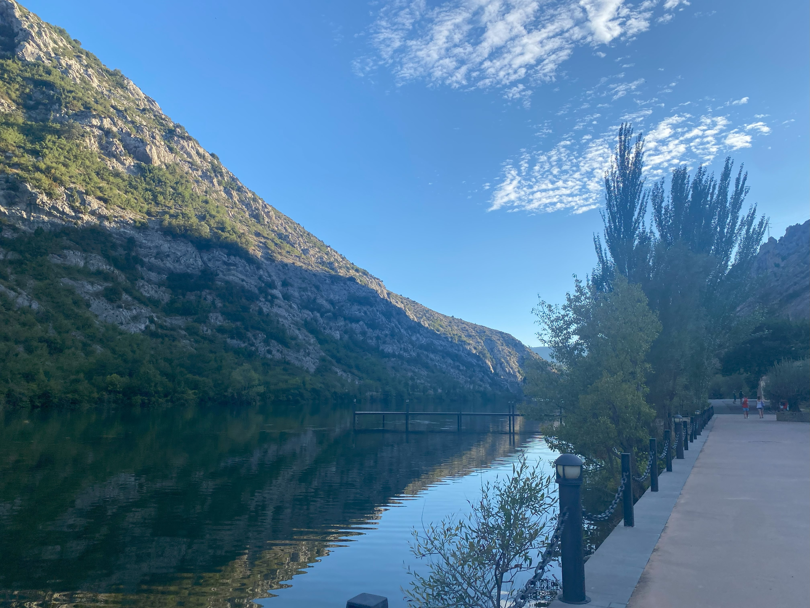

# Hi! I'm Olivia 👋 

- 🔬 I'm doing a PhD in Biomedical Engineering at the [Radiomics Group](https://radiomicsgroup.github.io/) in [VHIO](https://vhio.net/)
- 🧬 My research focuses on quantifying intratumor heterogeneity
- 🌱 I'm learning about oncology, medical images, machine learning, and open-source development
- 📫 You can reach me at oliviaprior@vhio.net

